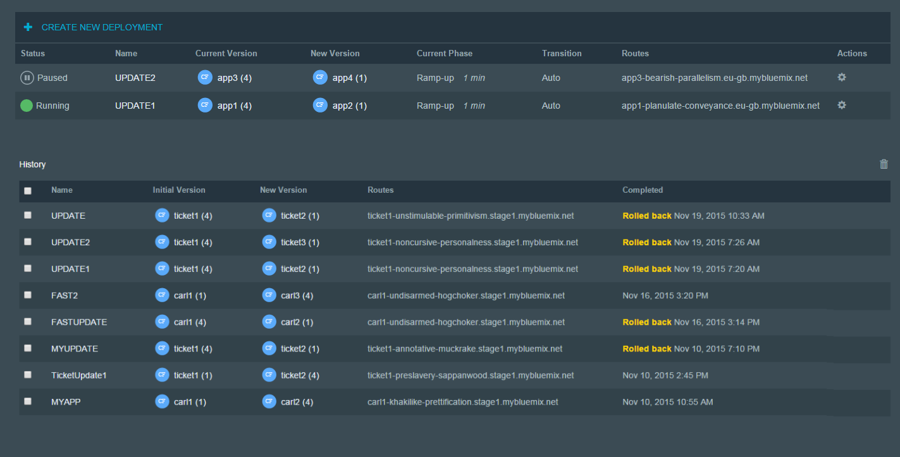
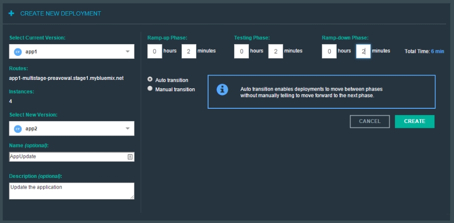
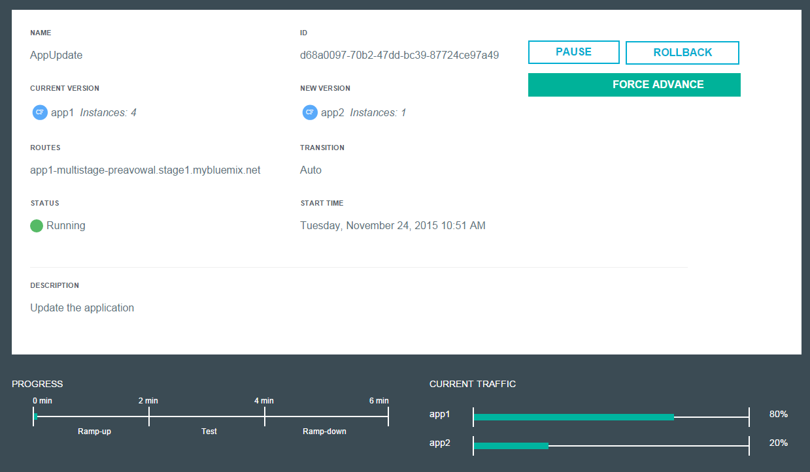

# Active Deploy Dashboard Overview

The Active Deploy Dashboard is operational and yet simple to use. Here are the main screens for reference.

##Deployment Summary

The main dashboard screen -  View your current deployments as well as a history of any previous updates and their exit status,

Overview of function

1. Track status of current deployments
2. Control deployments with major operations
3. Access information about 

##Deployment Creation

The place to create a new deployment with all needed information.

Overview of function

1. The existing version
2. The new version
3. The type of deployment
4. The transition phase settings
5, Execute the deploy

##Deployment Control

View the status of your deployment as it is in progress or past details.

Overview of function

1. Basic information
2. Control buttons
3. Phase timings
4. Traffic version balance

 
