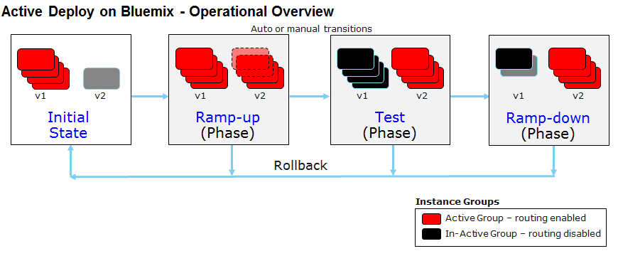

# Active Deploy Overview and Concepts

## Introduction

Web giants like Facebook, Netflix, Google, and Amazon continually innovate and release new features and capabilities – and never with any planned downtime or outages.
How do they do it?

Organization DevOps teams want to provide the same capability for their clients - fresh features, fast response to feedback, and rapid innovation. And in doing so, they also cannot accept downtime when updating a critical running application.
How can they do it?

If you're using the Bluemix Cloud Development platform, the answer is Active Deploy.

The Active Deploy service provides fully controlled and customized application update deployments, with zero downtime, with your own Bluemix cloud delivery applications. This allows users to update container or cloud foundry applications on IBM Bluemix with zero downtime, by using intelligent update deployment capabilities. It allows full control over the deployment configuration and allows mid-stream acceptance testing.

## Operational Overview

Operationally there are 4 essential stages

1. Original version - The initial stage is the initial running application.
2. Ramp-up phase - where the new version is being deployed based on configuration settings - this can be automatic or manual, and take any length of configured time. It’s where parallel version comparison testing can take place.
3. Test phase - is where the original version has been un-routed from accepting traffic, but the instances are still running - and the new version is now fully running. Extended production testing can now take place. Allows fast rollback if needed.
4. Ramp-down - phase where the original version is deleted, and the new version continues live.
